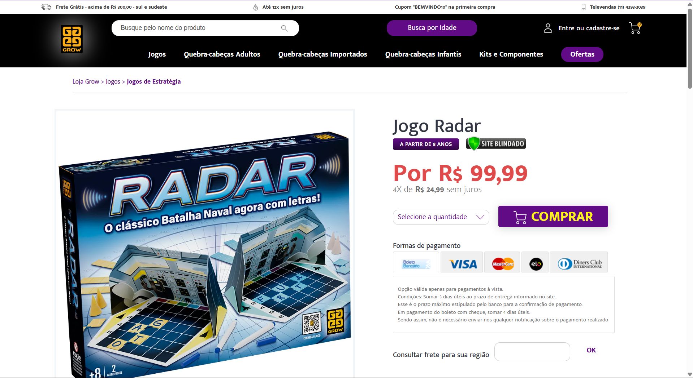
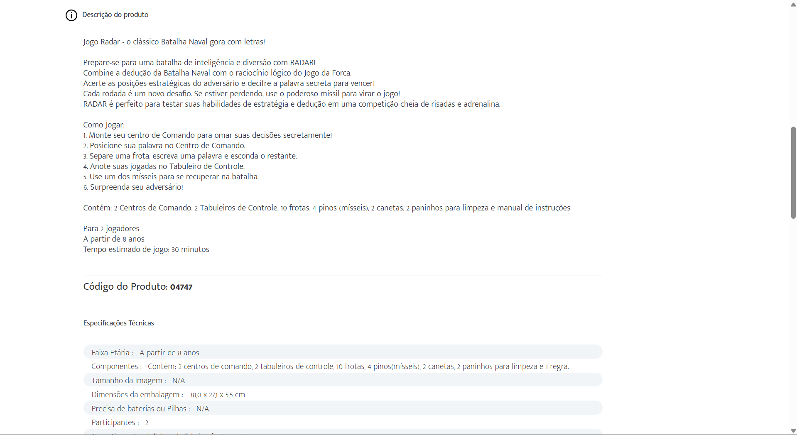
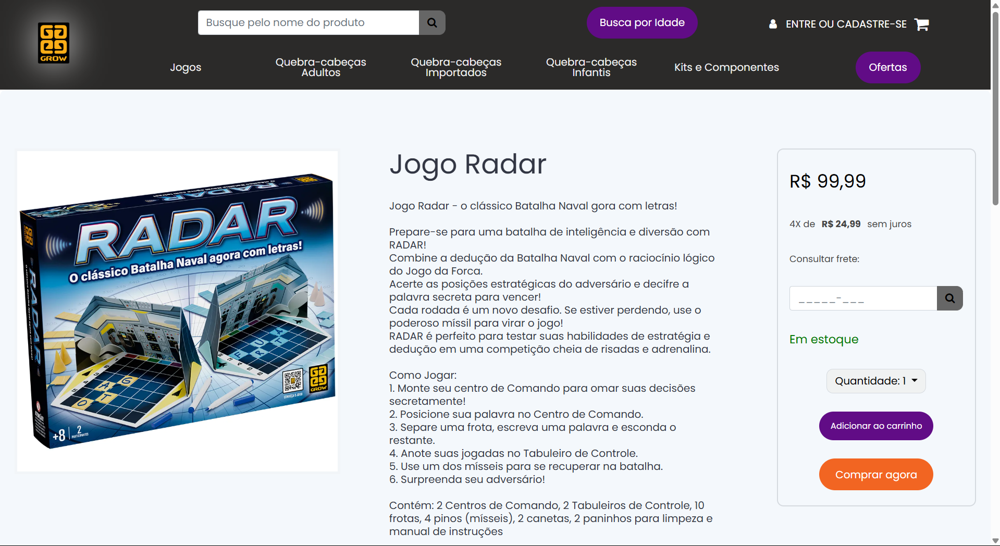
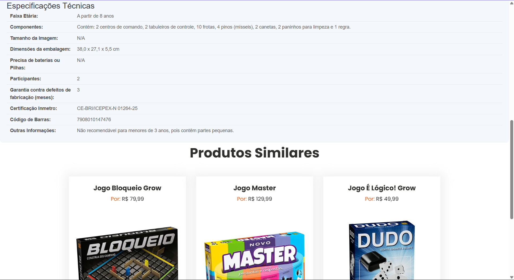

# Projeto: Remake de site/app web

Imagens do **site original**:



Imagens do **site criado**:



Acesso: https://elc1090.github.io/project1-2025a-meunomeali/html/


#### Desenvolvedor
Álisson Braga Canabarro, Ciência da Computação

#### Cliente
Giulia Rodrigues


#### Site/app original

##### Link
https://lojagrow.com.br/jogo-radar/p

##### Descrição
É um site de venda de jogos de tabuleiro.  
A página dos produtos possui, no topo, uma imagem grande do produto, com o preço e as formas de pagamento ao lado da imagem. As informações do produto ficam abaixo da imagem e do preço.

#### Demanda do(a) cliente
Melhorar o design de uma página de um dos produtos.

#### Desenvolvimento

Como não tenho experiência em desenvolvimento web, escolhi um template de site estático e trabalhei em cima dele.  
Comecei tentando deixar o header similar ao do site original e, para tentar melhorar a página do produto (como dito na demanda), tentei deixar o layout similar ao modelo da Amazon: imagem do produto na esquerda, detalhes no meio, opção de compra na direita e em baixo de tudo as especificações técnicas.  
As imagens e a descrição do produto foram retirados do site original.  
Do template usado, mantive (sem muitas alterações) os botões e o carrossel de itens, de resto modifiquei quase tudo (como pode ser visto [aqui](https://github.com/elc1090/project1-2025a-meunomeali/compare/7359363aea055a8fb47c9cfff559811564117242..241247a68b0a365cd7430a9e0ecea34e7003e88b))


#### Tecnologias

- HTML
- CSS
O template usado possui vários arquivos .js, mas não mexi em nenhum deles.

#### Ambiente de desenvolvimento

VS Code com as extensões:
- HTML CSS Support
- CSS Peek

#### Referências e créditos

- [Template](https://www.free-css.com/free-css-templates/page287/eflyer) do site [free-css](https://www.free-css.com).
- Chat GPT para tirar duvidas de como mexer com HTML e CSS. Exemplo de input:
```
[Código que eu tinha e estava com duvidas] 
Esse código é de uma coluna com varias linhas, mas atualmente  
o espaço entre as linhas é um tamanho fixo definido em cada linhas,  
mas eu queria que fosse tipo um display flex com justify-content: space-around,  
para que ele se espace sozinho, mas só funciona na horizontal, tem  
como fazer para funcionar na vertical ?
```
Output:
```
[Explicação]
flex-direction: column; /* Altera para coluna */
justify-content: space-around; /* Espaçamento vertical entre as linhas */
[Resto do código e mais explicação]
```


---
Projeto entregue para a disciplina de [Desenvolvimento de Software para a Web](http://github.com/andreainfufsm/elc1090-2025a) em 2025a
